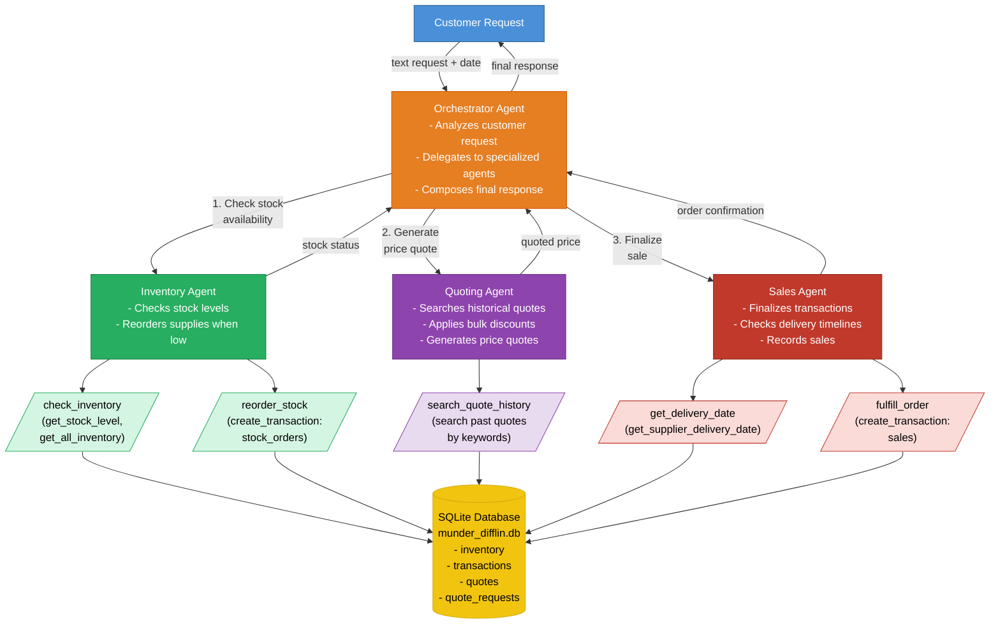

```mermaid
flowchart TD
    %% Entry
    Customer["Customer Request"]

    %% Orchestrator
    Orchestrator["Orchestrator Agent\n- Analyzes customer request\n- Delegates to specialized agents\n- Composes final response"]

    %% Specialized Agents
    InventoryAgent["Inventory Agent\n- Checks stock levels\n- Reorders supplies when low"]
    QuotingAgent["Quoting Agent\n- Searches historical quotes\n- Applies bulk discounts\n- Generates price quotes"]
    SalesAgent["Sales Agent\n- Finalizes transactions\n- Checks delivery timelines\n- Records sales"]

    %% Tools
    CheckInventory[/"check_inventory\n(get_stock_level,\nget_all_inventory)"/]
    ReorderStock[/"reorder_stock\n(create_transaction:\nstock_orders)"/]
    SearchQuotes[/"search_quote_history\n(search past quotes\nby keywords)"/]
    GetDelivery[/"get_delivery_date\n(get_supplier_delivery_date)"/]
    FulfillOrder[/"fulfill_order\n(create_transaction:\nsales)"/]

    %% Database
    DB[("SQLite Database\nmunder_difflin.db\n- inventory\n- transactions\n- quotes\n- quote_requests")]

    %% Flow
    Customer -->|"text request + date"| Orchestrator

    Orchestrator -->|"1. Check stock\navailability"| InventoryAgent
    Orchestrator -->|"2. Generate\nprice quote"| QuotingAgent
    Orchestrator -->|"3. Finalize\nsale"| SalesAgent

    InventoryAgent --> CheckInventory
    InventoryAgent --> ReorderStock

    QuotingAgent --> SearchQuotes

    SalesAgent --> GetDelivery
    SalesAgent --> FulfillOrder

    CheckInventory --> DB
    ReorderStock --> DB
    SearchQuotes --> DB
    GetDelivery --> DB
    FulfillOrder --> DB

    InventoryAgent -->|"stock status"| Orchestrator
    QuotingAgent -->|"quoted price"| Orchestrator
    SalesAgent -->|"order confirmation"| Orchestrator

    Orchestrator -->|"final response"| Customer

    %% Styling
    style Customer fill:#4A90D9,stroke:#2C5F8A,color:#fff
    style Orchestrator fill:#E67E22,stroke:#D35400,color:#fff
    style InventoryAgent fill:#27AE60,stroke:#1E8449,color:#fff
    style QuotingAgent fill:#8E44AD,stroke:#6C3483,color:#fff
    style SalesAgent fill:#C0392B,stroke:#922B21,color:#fff
    style DB fill:#F1C40F,stroke:#D4AC0D,color:#000
    style CheckInventory fill:#D5F5E3,stroke:#27AE60,color:#000
    style ReorderStock fill:#D5F5E3,stroke:#27AE60,color:#000
    style SearchQuotes fill:#E8DAEF,stroke:#8E44AD,color:#000
    style GetDelivery fill:#FADBD8,stroke:#C0392B,color:#000
    style FulfillOrder fill:#FADBD8,stroke:#C0392B,color:#000
```
